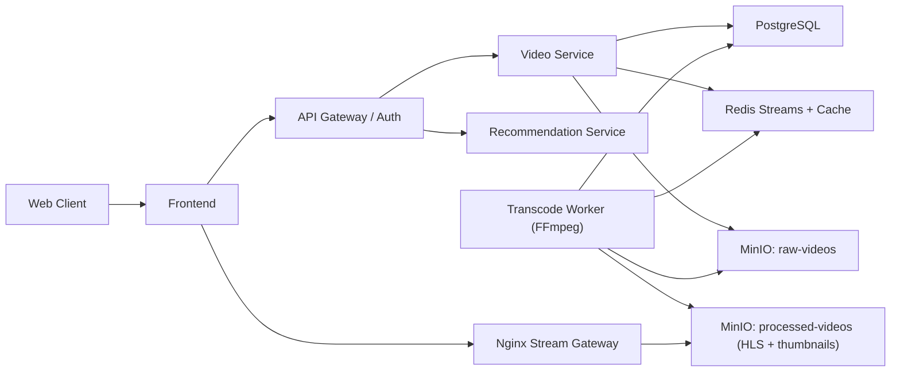
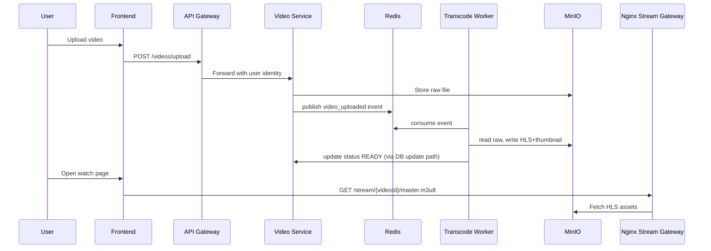

# ScalaStream Comprehensive Competition Report
## Video Streaming Systems - WebSystems & Machine Learning Competition (Ingenium IIT Indore)

Date: March 15, 2026  
Project: ScalaStream  
Submission Type: Working Web Application + Architecture + ML Explanation + Strategy Documentation

---

## 1. Executive Summary
ScalaStream is a complete Video-on-Demand (VOD) streaming platform designed for the competition requirements: upload, asynchronous transcoding, low-latency playback, metadata interactions, and machine-learning-driven recommendations.

The platform is intentionally built as a production-style, multi-service system while still being practical to run locally for judges. It combines system design quality (scalability/fault handling/cost tradeoffs) with a real recommendation pipeline that learns from user behavior.

Current live system snapshot (local run):
- Ready videos: 16
- Recommendation model: `hybrid_bpr_content_calibrated`
- Model family: `bpr_matrix_factorization + logistic_blend_calibration`
- Calibration diagnostics available (`blend_auc`, `blend_logloss`, `blend_weights`)

---

## 2. Competition Goal Interpretation
The competition expects:
1. A fully functional video streaming product.
2. Distributed systems thinking (ingestion, processing, storage, delivery, reliability).
3. Explicit scalability/cost tradeoff justification.
4. A recommendation system that is genuinely ML-based (not static rule lists).

ScalaStream addresses these through a service-oriented design and a hybrid recommendation engine combining collaborative learning, content profiles, and learned score calibration.

---

## 3. Scope and Assumptions Alignment

Required scope assumptions and ScalaStream alignment:
- Live streaming not required -> ScalaStream is VOD-only by design.
- Real-world internet scale not mandatory -> Local Dockerized deployment is used.
- Synthetic/mock data allowed -> Demo seeding and scripted activity generation are supported.
- Conceptual horizontal scalability required -> Architecture supports replication of stateless APIs and worker scaling.

---

## 4. System Architecture

## 4.1 Component-Level Architecture


## 4.2 Component Responsibilities
- Frontend:
  - Home/feed/watch/manage views, search, upload, recommendation rails, quality/speed controls.
- API Gateway:
  - Authentication endpoints, token handling, identity forwarding to backend services.
- Video Service:
  - Upload, metadata, comments/likes/views, history, search, video lifecycle state.
- Transcode Worker:
  - Event-driven transcoding and packaging into streamable HLS variants.
- Recommendation Service:
  - Model training, model persistence, ranked feed APIs.
- PostgreSQL:
  - System-of-record for users, videos, interactions, and history.
- Redis:
  - Event queue (stream) and hot counter caching.
- MinIO:
  - Raw and processed video objects.
- Nginx Stream Gateway:
  - Stream asset routing and delivery path for HLS manifests/segments.

## 4.3 End-to-End Data Flow


---

## 5. Functional Requirements Coverage

| Requirement | ScalaStream Coverage |
|---|---|
| User authentication and authorization | Register/login/session bootstrap with JWT; authenticated actions are gated. |
| Video upload functionality | Multipart upload endpoint with validation and owner mapping. |
| Video transcoding and storage | Async queue + worker pipeline to HLS renditions and object storage. |
| Video streaming playback | Dedicated watch flow and HLS playback through stream gateway. |
| Metadata handling | Likes, comments, views, watch sessions, counters, and history. |
| ML recommendation feed | Personalized `For You` feed with trained model and reason tags. |

Additional product quality:
- Search by title/description with ranking.
- Per-user liked-state and like/unlike integrity.
- Watch history and search history surfaced in UI.

---

## 6. Non-Functional Requirements Coverage

## 6.1 Low-Latency Delivery
- HLS playback path is direct and cache-friendly.
- Streaming delivery is separated from API logic through Nginx stream gateway.

## 6.2 High Availability and Fault Tolerance (Competition Scale)
- Upload ingestion is decoupled from compute-heavy transcoding via Redis stream.
- Worker retries failed jobs and can recover pending messages.
- Health endpoints and status polling expose service state.

## 6.3 Cost Efficiency
- Two-rendition ladder (360p/720p) controls transcode and storage overhead.
- Scheduled model retraining avoids per-request training cost.
- Local Docker setup avoids cloud spending for competition.

## 6.4 Scalability
- Stateless services can be replicated.
- Workers can scale horizontally through shared stream group consumption.
- Object storage and metadata services are separated to avoid monolithic bottlenecks.

## 6.5 Graceful Failure Handling
- Failed transcodes are visible and retryable.
- Queue status and attempts are exposed.
- System remains usable while processing is pending.

## 6.6 Tradeoff Clarity
- Redis selected for operational simplicity vs Kafka complexity.
- Hybrid recommender selected for strong quality-to-compute ratio on local hardware.

---

## 7. Machine Learning Recommendation System (Detailed)

This section addresses the mandatory AI/ML requirement directly.

## 7.1 Why ML is Used
Recommendation quality depends on changing user behavior. A static rule list cannot adapt when user interests evolve across sessions. ScalaStream uses ML to:
- learn latent user-video affinities from interaction history,
- combine collaborative behavior with content and search intent,
- re-rank based on newly observed activity after retraining.

## 7.2 Data Used for Learning
Training input is built from:
- watch behavior (`watch_time`, completion progression),
- likes and comments,
- per-user search history,
- video text metadata (title and description),
- popularity and recency context.

This satisfies the requirement that recommendations must be derived from watch history, likes, and engagement patterns.

## 7.3 Model Design (Hybrid Stack)
ScalaStream `For You` ranking uses a layered model:
1. Collaborative layer:
   - Learns user/item embeddings using BPR matrix factorization from implicit feedback.
2. Content/profile layer:
   - Builds semantic vectors from item text and user search/watch profiles.
3. Calibration layer:
   - Learns final blending weights via logistic calibration on sampled positive/negative pairs.

Final ranking is a learned blend of:
- collaborative embedding score,
- offline content profile similarity,
- live behavior profile similarity,
- popularity prior,
- recency prior.

## 7.4 Why This Is Not Rule-Based
The personalized feed is not a hardcoded if-else system because:
- model parameters are trained from data,
- blending coefficients are learned, not fixed constants,
- outputs vary by user profile,
- retraining updates ranking behavior.

## 7.5 Current Model Evidence (Live)
From the running service:
- `mode`: `hybrid_bpr_content_calibrated`
- `model_family`: `bpr_matrix_factorization + logistic_blend_calibration`
- `blend_samples`: 80
- `blend_logloss`: 0.1369
- `blend_auc`: 0.9936
- learned blend weights currently prioritize collaborative signal with meaningful content/live contributions.

## 7.6 Example Personalization Behavior
Observed `For You` differences:
- Viewer profile (fun/gaming/travel searches) pushes content-matching entertainment/gameplay items upward.
- Creator profile (distributed systems/ML/transcoding searches) pushes technical/IIT-focused items higher.
- Same video set, different user ordering and reason tags.

This behavior demonstrates user-dependent ranking rather than universal sorting.

## 7.7 Explainability in Product
Each recommendation item returns:
- score,
- source,
- reason,
- reason tags (e.g., `taste-match`, `content-match`, `history-match`, `recent`).

This helps judges understand why an item appears in the ranked list.

---

## 8. Metadata Integrity and User Interaction Quality

## 8.1 Likes and Comments
- Likes require authentication and enforce user-video uniqueness.
- Comments require authentication and input sanitation.

## 8.2 View and Retention Logic
- View events are sessionized.
- Qualified views are counted only when thresholds are met.
- Watch-time updates are delta-based to reduce overcounting.
- Retention metrics are derived from session progression.

This gives realistic engagement signals for recommendation training.

---

## 9. Search and Discovery
- Server-side search endpoint supports ranked retrieval across title and description.
- Search history is stored per authenticated user.
- Search behavior contributes directly to recommendation profiles.

Result:
- Better discovery quality even when titles are imperfect.
- Strong cold-start support through search intent signals.

---

## 10. Optional Features Coverage

| Optional Feature | Status |
|---|---|
| Adaptive video quality selection | Implemented |
| Playback speed control | Implemented |
| Enhanced recommendation filters | Implemented (`For You`, `Trending`, `Fresh`, `Continue Watching`) |

---

## 11. Deliverables Mapping

| Required Deliverable | Provided |
|---|---|
| Working web application (upload/playback/metadata) | Yes |
| System architecture diagram | Yes |
| Scalability and cost strategy explanation | Yes |
| ML recommendation approach explanation | Yes |
| Source repository with README | Yes |

Supporting documents in `docs/`:
- Architecture
- Compliance matrix
- Scalability/cost tradeoffs
- ML approach
- Demo script
- API contracts

---

## 12. Judge Runbook (Independent Verification)

1. Start stack:
```powershell
docker compose up -d --build
```
2. Open app:
- `http://localhost:3000`
3. Validate:
- Register/login
- Upload video
- Poll processing status
- Open watch page playback
- Like/comment/view actions
- Check `For You` and `Trending`
- Trigger retrain and observe recommendation refresh

Persistence note:
- `docker compose down` keeps data.
- `docker compose down -v` resets all persistent volumes.

---

## 13. Demonstration Script (Under 7 Minutes)
1. Sign in and show authenticated UI state.
2. Upload one video and show queue/progress/status lifecycle.
3. Open watch page and play stream.
4. Show playback quality and speed controls.
5. Perform like/comment and show updated metadata.
6. Show watch/search history entries.
7. Open `For You` and explain reasons.
8. Open `Trending` and explain engagement-based ranking.
9. Click retrain and show updated recommendation state.

---

## 14. Risks, Limitations, and Future Roadmap

Current competition-targeted limitations:
- Single-node local deployment is not multi-region production HA.
- Catalog size in demo environment is modest.

Planned upgrades after competition:
- richer offline evaluation metrics at larger scale (NDCG/MAP pipelines),
- optional deep sequence model for session-level next-video prediction,
- stronger observability dashboards and automated benchmark reports.

---

## 15. Final Conclusion
ScalaStream delivers a complete, demonstrable streaming platform with real ML personalization, clear system design tradeoffs, and practical judge reproducibility.

The submission is aligned with all major competition expectations:
- working product behavior,
- distributed systems architecture,
- cost/scalability reasoning,
- and non-static, behavior-driven machine learning recommendations.

