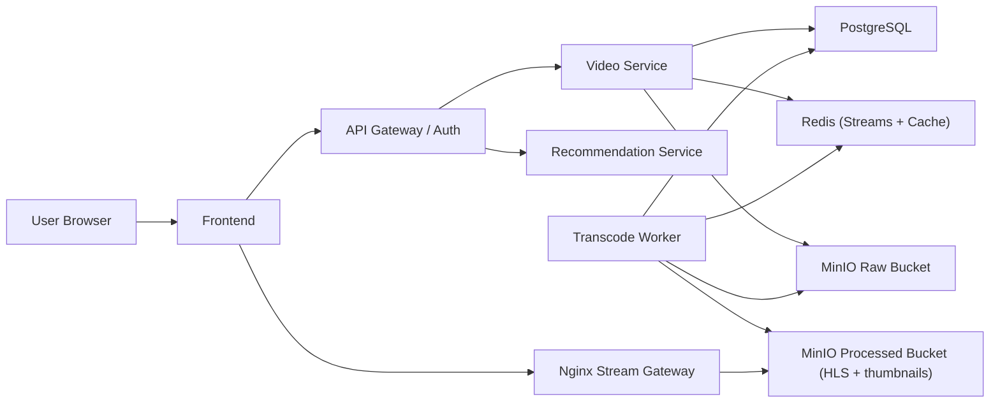

# ScalaStream Final Submission Report
## Ingenium IIT Indore: Video Streaming Systems (WebSystems + ML)

Date: March 15, 2026  
Team Project: ScalaStream

---

## 1. Problem Summary
ScalaStream is a Video-on-Demand streaming platform built to demonstrate:
- concurrent video upload,
- asynchronous transcoding,
- low-latency playback,
- metadata interactions (likes/comments/views),
- and machine-learning based personalized recommendations.

The project is implemented for local judge execution using Docker Compose and production-style service separation.

---

## 2. Scope and Assumptions (As Required)
- Live streaming is not required.
- Real-world production-scale deployment is not mandatory.
- Mock/synthetic data may be used.
- Architecture must conceptually support horizontal scaling.

How ScalaStream aligns:
- VOD-only workflow is implemented (no live ingest path).
- Local deployment is used for evaluation.
- Demo seeding scripts generate synthetic users/interactions.
- Service decomposition and queue-worker model support horizontal scale conceptually.

---

## 3. Working Application Overview
The submitted application demonstrates:
- video upload and processing,
- HLS playback in browser,
- metadata handling,
- recommendation feeds.

### Core Services
- `frontend` (UI)
- `api-gateway` (auth + routing)
- `video-service` (upload, metadata, search, history, views)
- `transcode-worker` (FFmpeg, HLS, thumbnail generation)
- `recommendation-service` (model training and feed ranking)
- `postgres`, `redis`, `minio`, `stream-gateway` (Nginx)

---

## 4. System Architecture Diagram


### Data Flow (Upload to Watch)
1. User uploads video (`POST /videos/upload`).
2. Raw file stored in MinIO; event pushed to Redis stream.
3. Worker transcodes to HLS (`360p`, `720p`) and generates thumbnail.
4. Video status moves to `READY`.
5. Frontend watch page streams via `/stream/{videoId}/master.m3u8`.

---

## 5. Functional Requirement Compliance

| Requirement | Status | ScalaStream Implementation |
|---|---|---|
| User authentication/authorization | Met | Register, login, `/auth/me`, JWT |
| Video upload functionality | Met | Multipart upload + owner mapping |
| Video transcoding and storage | Met | Async FFmpeg worker + MinIO |
| Video playback | Met | HLS watch page + stream gateway |
| Metadata (likes/comments/views) | Met | Auth-gated likes/comments, qualified views |
| ML-based recommendation feed | Met | Personalized `/feed/recommended` |
| Concurrent uploads support | Met | Queue-based async processing |

---

## 6. Non-Functional Requirement Coverage

| Requirement | Coverage |
|---|---|
| Low-latency delivery | HLS via Nginx gateway with cache-friendly delivery |
| High availability / fault tolerance | Queue decoupling, retries, status polling, worker recovery flow |
| Cost-efficient storage/network | Two-rendition ladder (360p/720p), object storage separation |
| Scalable architecture | Stateless services + scalable worker group concept |
| Graceful failure handling | Transcode fail state, retry/finalize path, health checks |
| Tradeoff justification | Included in scalability and cost strategy |

---

## 7. Machine Learning Recommendation Approach (Simple, Judge-Friendly)

## Why ML is used
Static rules cannot personalize feeds well when user interests change.  
ScalaStream uses ML to learn user taste from behavior and rank videos per user.

## Data used by the model
- watch history and completion behavior,
- likes and comments,
- search history,
- video text content (title/description),
- engagement context (views/watch time/recency).

## How the model works (without heavy math)
1. Build user-item interaction strength from watch depth + engagement.
2. Train collaborative embeddings (BPR matrix factorization) from user behavior.
3. Build content profiles using text embeddings and search signals.
4. Learn score-combination weights using logistic calibration (trained, not hardcoded).
5. Generate final personalized rank from collaborative + content + live profile + popularity + recency signals.

## Why this is not rule-based
- It has trained model parameters (user/item embeddings and learned blend weights).
- It retrains from new data.
- Different users receive different ranking orders from the same catalog.
- The service exposes training diagnostics in model summary (`blend_auc`, `blend_logloss`, learned weights).

---

## 8. Recommendation Proof Points for Evaluation
- Recommendation mode reported by service: `hybrid_bpr_content_calibrated`.
- Model family: `bpr_matrix_factorization + logistic_blend_calibration`.
- Personalized endpoint: `GET /feed/recommended?userId=...`.
- Multiple feed types for UX: `For You`, `Trending`, `Fresh`, `Continue Watching`.
- Retrain support: `POST /feed/train` (UI button: Retrain Model).

Judge demo validation:
1. Login with two different users.
2. Open `For You` for each user.
3. Show different ranking orders and reason tags.
4. Interact (watch/like/search), retrain, and show changed ordering.

---

## 9. Scalability and Cost Optimization Strategy

### Scalability
- Stateless API services can be replicated behind a load balancer.
- Redis streams allow multiple worker consumers for transcode scale-out.
- Object storage keeps media growth independent from app containers.

### Cost optimization
- Local Docker deployment avoids cloud spend for competition.
- Two quality renditions balance quality vs storage and processing cost.
- Scheduled training is cheaper than training on every request.
- Redis serves as queue + cache to keep infra simple in v1.

### Tradeoff clarity
- Redis chosen over Kafka for lower setup complexity.
- Hybrid recommender chosen over heavy deep models for faster local retraining.

---

## 10. Optional Features Implemented
- Adaptive quality selection (`Auto`, `360p`, `720p`)
- Playback speed control (`0.75x` to `2x`)
- Enhanced recommendation filters (`For You`, `Trending`, `Fresh`, `Continue Watching`)

---

## 11. Deliverables Checklist

| Deliverable | Included |
|---|---|
| Working web app (upload, playback, metadata) | Yes |
| System architecture diagram | Yes (in this report + docs) |
| Scalability and cost strategy explanation | Yes |
| ML recommendation explanation | Yes |
| Source repository with README | Yes |

---

## 12. How Judges Can Run It Independently
```powershell
docker compose up -d --build
```
Open:
- `http://localhost:3000`

Important:
- `docker compose down` keeps data volumes.
- `docker compose down -v` resets all data.

---

## 13. 7-Minute Demo Script
1. Open app and log in.
2. Upload a video and show queued/transcoding status.
3. Open watch page and play HLS stream.
4. Show quality and speed controls.
5. Like and comment as authenticated user.
6. Show watch/search history.
7. Show `For You` recommendations.
8. Trigger retrain and show recommendation refresh.
9. Show `Trending` as global engagement ranking.

---

## 14. Conclusion
ScalaStream satisfies the competition requirements with a complete end-to-end platform and a genuine ML recommendation pipeline.  
It is practical for local judge evaluation, clearly documents architecture and tradeoffs, and demonstrates personalization beyond static rules.

