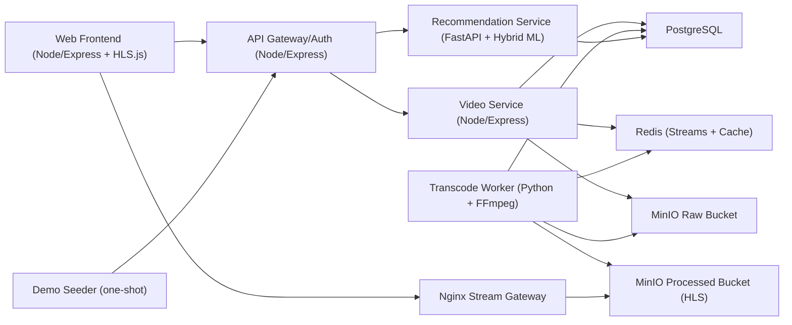
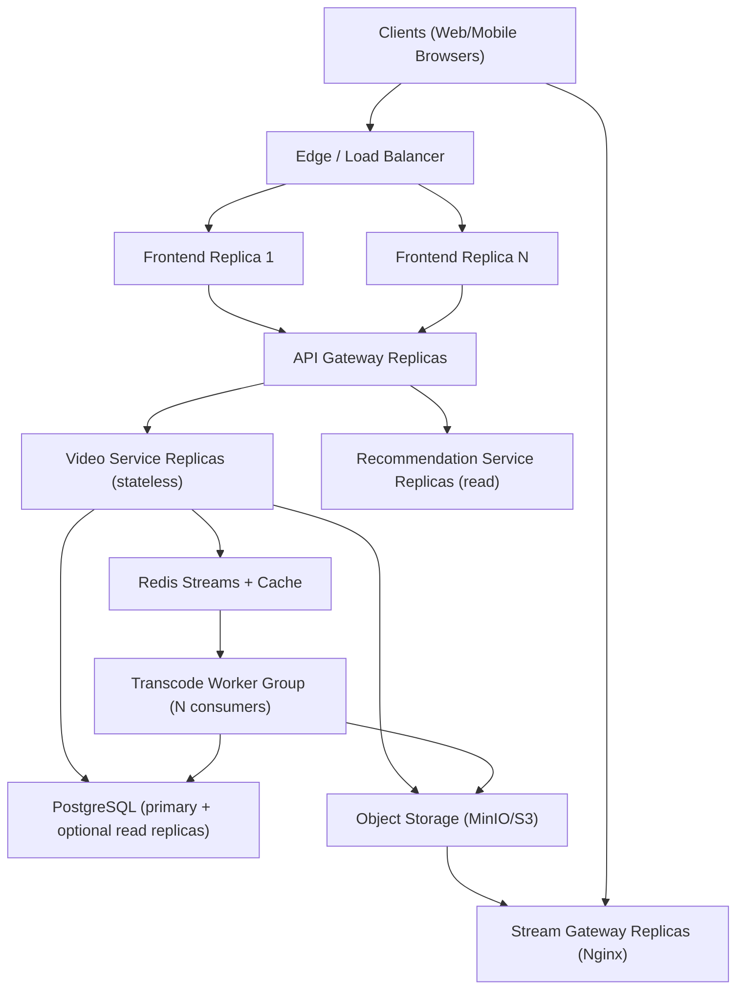

# ScalaStream Architecture

## Component Diagram

## Upload to Playback Flow
1. User uploads a video from frontend to `POST /videos/upload`.
2. `video-service` stores raw file in MinIO `raw-videos` and writes `videos` row with `UPLOADED`.
3. `video-service` pushes `video_uploaded` event to Redis stream.
4. `transcode-worker` consumes event, transcodes to HLS 360p/720p using FFmpeg, uploads artifacts to MinIO `processed-videos`.
5. Worker updates status to `READY` and emits `transcode_completed`.
6. Frontend streams from `GET /stream/{videoId}/master.m3u8` via Nginx.

## Metadata + Recommendation Flow
1. Likes/comments/views are written to Postgres and hot counters updated in Redis.
2. Views are sessionized (`video_watch_sessions`) so `view_count` only increments on qualified playback.
3. Search history is stored in `user_search_events`; watch history is available from session tables.
4. Recommendation service retrains periodically from user behavior:
   - watch history (delta watch time + completion)
   - likes/comments engagement
   - search history embeddings
   - item text embeddings (title/description)
5. `GET /feed/recommended?userId=...` returns hybrid ML-ranked items with reason tags.

## Horizontal Scalability View (Conceptual)

## Fault Tolerance Notes
- Upload requests are acknowledged quickly and decoupled from transcoding via Redis stream events.
- Transcode jobs are idempotent and retry-capable; a worker crash does not lose queued uploads.
- Service degradation is surfaced in UI with health banners and retry controls.
- Persistent data is isolated in Docker volumes (`postgres_data`, `minio_data`, `redis_data`) to survive container restarts.

## Scope Assumptions
- Live streaming is intentionally excluded; architecture targets VOD.
- Local Compose deployment is used for judging, while the component split supports horizontal growth conceptually.
